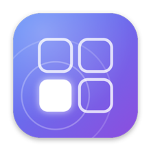
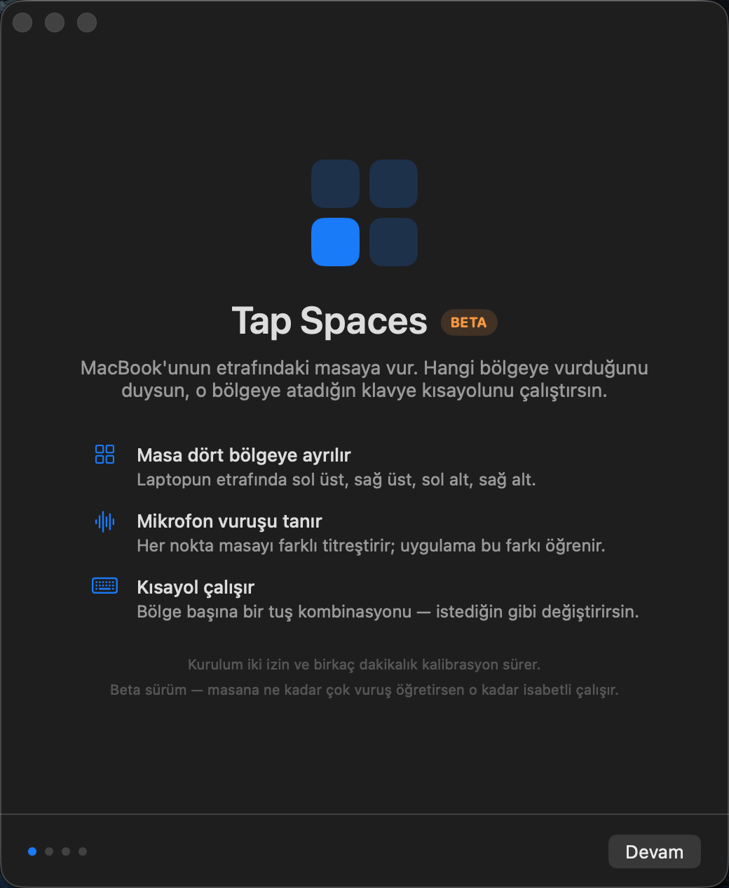
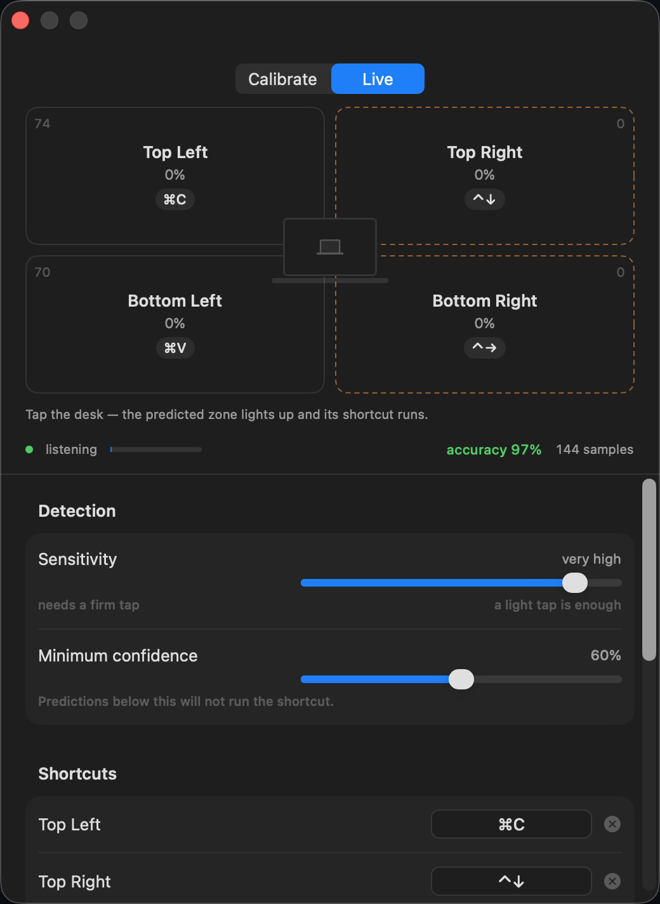

<div align="center">



# Tap Spaces

**Tap the desk around your MacBook. It works out which zone you hit, and runs the keyboard shortcut you bound to it.**

No extra hardware. No sensors. Just the microphone that is already there.


<br>

**[Website](https://adilmustafayilmaz.github.io/Tap-Spaces/)** · [Releases](https://github.com/adilmustafayilmaz/Tap-Spaces/releases)

<br><br>


</div>

<br>

Knock on the left side of your desk and the previous desktop slides in. Knock on
the right and the next one does. The laptop never moves, your hands never leave
the desk, and nothing is attached to anything.

---

## Install

```bash
brew tap adilmustafayilmaz/tap
brew trust adilmustafayilmaz/tap
brew install --cask tap-spaces
```

`brew trust` is needed because Homebrew treats third-party taps as untrusted by
default. It marks this tap as allowed to load and grants nothing else.

Signed with a Developer ID certificate and notarised by Apple, so it opens
without a Gatekeeper warning. Available in English and Turkish.

---

## Why it is not triangulation

The obvious approach — time the sound arriving at different microphones and
solve for the source — is impossible here. macOS exposes the MacBook microphone
array as a **single beamformed channel**:

```
$ system_profiler SPAudioDataType
    MacBook Pro Microphone:
      Input Channels: 1
```

One channel means no inter-channel delay to compare. There is no direction to
compute.

So Tap Spaces classifies each tap by its **acoustic fingerprint** instead. Where
you hit the desk changes four things at once:

| Cue | What changes |
|---|---|
| Distance | Amplitude, and how much high frequency survives the trip |
| Resonance | Every point excites a different mix of table modes |
| Direct-to-reverberant ratio | Rises as the source moves away from the mic |
| Attack and decay | Set by the contact point and the path the sound takes out |

Every tap becomes a 56-dimension vector — log-spectrum bands measured separately
over the full window, the attack and the tail; the decay envelope across six
slices; spectral centroid; direct-to-reverberant ratio; zero-crossing rate.

The band values are mean-removed, so the model reads *where* you hit rather than
*how hard*. Classification is a distance-weighted k-nearest-neighbour over
standardised features. It trains instantly and pulls in no dependencies.

---

## Setting it up

<table>
<tr>
<td width="50%" valign="top">

</td>
<td width="50%" valign="top">

</td>
</tr>
<tr>
<td valign="top">

**First run** walks through the two permissions the app needs — microphone to
hear the taps, accessibility to send the keystrokes — then hands over to
calibration.

</td>
<td valign="top">

**Calibration** teaches the app your desk. Pick a zone, tap that spot 20 to 30
times, repeat for the zones you want. Live mode fills each tile in proportion to
its score, so you can watch the model decide.

</td>
</tr>
</table>

The accuracy figure is leave-one-out cross-validation: every sample is scored
against a model built without it, never against itself.

**You do not have to calibrate all four zones.** Two zones on the same side
works. So does one — though a single zone cannot discriminate, so every tap is
read as that zone, turning the app into one desk-wide trigger.

Fewer zones are easier to tell apart. Choosing between two is markedly more
reliable than choosing between four.

---

## Limits

- **The setup has to stay put.** Move the laptop or the desk and the fingerprint
  changes. Recalibrate.
- **Surface matters.** Hard resonant wood separates well. Thick felt or heavy
  glass damps the differences and the zones converge.
- **Left and right beat top and bottom.** Top and bottom zones can sit at similar
  distances from the microphone. If accuracy is poor, spread the zones further
  apart.
- **Do not type while calibrating.** Keystrokes get recorded as samples.
- **Raise the confidence floor** for any zone bound to something you cannot undo.
- **More samples, better results.** This is a beta; the model sharpens
  measurably the more taps you give it.

The app is not sandboxed. It posts synthetic key events to other applications and
no sandbox entitlement permits that, which is also why it ships outside the Mac
App Store.

---

## Build from source

```bash
git clone https://github.com/adilmustafayilmaz/Tap-Spaces.git
cd Tap-Spaces
./build.sh --install
```

Requires Xcode command line tools. `build.sh` redraws the icon, compiles, runs
the self-test, assembles the bundle and signs it — with a Developer ID
certificate if one is installed, ad-hoc otherwise.

```bash
.build/release/TapSpaces --selftest
```

Checks the FFT and band mapping, loudness invariance (the same tap at 0.25x and
2.5x amplitude has to land in the same place), k-NN accuracy, leave-one-out
cross-validation, JSON round-tripping and key formatting. It runs on every build.

```bash
./release.sh
```

Builds, archives, submits to the Apple notary service, staples the ticket and
re-archives the stapled copy. Notary credentials are read from a Keychain
profile, never from the command line or this repository.

[ARCHITECTURE.md](ARCHITECTURE.md) covers the source layout, the permission
model and why rebuilding used to break the Accessibility grant.

---

## License

[MIT](LICENSE). Fork it, ship it, bend it — a copyright line is all it asks.
